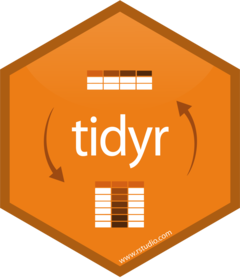

```{r, echo = FALSE, message=FALSE, warning=FALSE}
library(shiny)
library(tidyverse)
library(networkD3)

```
  
## Can open source tools be a true alternative for many applications? { .build .smaller}

- software development companys like windows, apple ... graphpad, SPSS... produce usable, mostly good software
- but:

    - products are getting increasingly expansive and update/support dependent
    - the users loose their independence and individuality
    - users can only to a certain degree personalize, optimize, adapt the applications for their needs
    - most of those products can lead to results, but they are not really efficent nor powerful nor leading edge
    - product placement strategies of those companys are unmatched
    --> users are more and more degraded to dependent consumers, than rather beeing their own developers
    

***

<br>
<br>

  > Why not use open source software tools, with millions of active developers, which can even be much more powerful, efficent and elegant than commercial products?


## DevOps, modern (software) development practices  
  
  - guarantee version control, reproducibility, collaboration and efficient workflows
   
  - automate everything, that can be automated
    
  - after doing the exact same operation more than three times, write a function for it, automate it
    
  - ...
 
## data science

- much of the research in healthcare, in medicine is **data science**

- successful biostatisticans and developers tackle their problems in a data science way

- data science provides thousands of modelling techniques, algorithms, version control systems and workflows that can be implemented in healthcare/biomedical research

- ...


# data science core toolbox 


*** 

```{r, out.width="10%", fig.align='left', echo = FALSE}
knitr::include_graphics("img/Rlogo.png")
```

- founded 1992
- initially only as a terminal interface == a common line interface
- initially as a statistical software
- R developed rapidly and is currently, together with python one of the fastest growing programming languages
- for computational intensive tasks the high level programming languages like C++ or Fortran are used
- millions of contributers
- > 15000 packages
- to call some repositories: Bioconductor, CRAN, GitHub


***
```{r, out.width = "15%", fig.align='left', echo = FALSE}
knitr::include_graphics("img/RStudio.png")
```
<br>

### graphical user interface, integrated development environment
<br>

- many different addins (for example to manipulate data in a spreadsheet(excel) style, to insert citations, pictures, edit tables, plotting etc.)

- options for setting up connections to databases, servers, git repositories, internal html viewer etc.


# data science core packages for R
***
```{r, out.width="15%", fig.align='left', echo = FALSE}
knitr::include_graphics("img/tidyverse.png")
```
```{r, comment=""}
tidyverse_packages()
```

## Overview {.flexbox .vcenter }

<div class="columns-2">

```{r, out.width="12%", fig.align="center", echo = FALSE}

knitr::include_graphics("img/dplyr.png")
knitr::include_graphics("img/ggplot2.png")

knitr::include_graphics("img/bookdown.png")
knitr::include_graphics("img/shiny.png")
knitr::include_graphics("img/purrr.png")

```


  - tidy data

  - manipulate data

  - The Grammar of Graphics

  - create reports, articles...

  - write books

  - create Web Apps

  - functional programming

  - ...

</div>


## R Markdown and inline code {.smaller}

```{r, message=""}
#`r......`
```

<br>
<br>

```{r}
#Fünf plus drei ist `r 5+3`
```

<br> 

Fünf plus drei ist `r 5+3`. 

***

```{r warnings=FALSE, message="", echo = FALSE, comment=""}


greetings <- tibble::tribble(
 ~name,~Geschlecht, ~date,             ~location, ~reason,
 "Peter","m", ("11.09.2020"),  "Dresden", "Dampferfahrt",
 "Jonas","m", ("12.09.2020"), "Meißen", "Stadtbesichtigung",
 "Anna", "w", ("13.09.2020"), "Moritzburg", "Gesellschaftsjagd"
)
greetings <- as.data.frame(greetings)
rownames(greetings)<-c("Peter", "Jonas", "Anna")
greetings
```

<br>

```{r}
Name <- "Peter"
 
# Lieber `r greetings[Name,1]`,
# Wollen wir uns am `r greetings[Name,3]` in `r greetings[Name,4]` ...
```
Lieber `r greetings[Name,1]`,
<br>
wollen wir uns am `r greetings[Name,3]` in `r greetings[Name,4]` treffen und eine `r greetings[Name,5]` unternehmen? Diese wird etwa `r lubridate::hour(lubridate::dmy_h(paste(greetings[Name,3], 3)))` Stunden dauern.

***

```{r}
Name <- "Jonas"
```
Lieber `r greetings[Name,1]`,
<br>
wollen wir uns am `r greetings[Name,3]` in `r greetings[Name,4]` treffen und eine `r greetings[Name,5]` unternehmen? Diese wird etwa `r lubridate::hour(lubridate::dmy_h(paste(greetings[Name,3], 3)))` Stunden dauern.
<br>
<br>

```{r message=FALSE, warning=FALSE}
library(broom)
library(DT)
options(digits = 4)
x <- cor.test(diamonds$carat, diamonds$price, 
              method = "pearson", 
              alternative = "two.sided")
x <- tidy(x)
```

***
```{r}
datatable(x, editable = "cell", options = list(scrollX = TRUE))
```
<br>

```{r}
#Die Korrelation zwischen Diamanten Preis und Karat
#beträgt `r cor(diamonds$carat, diamonds$price, method = "pearson")`
#(95% CI = `r x$conf.low`-`r x$conf.high`). 
```

Die Korrelation zwischen Diamanten Preis und Karat beträgt `r cor(diamonds$carat, diamonds$price, method = "pearson")` 
(95% CI = `r x$conf.low`-`r x$conf.high`). 

```{r message=FALSE, warning=FALSE, echo = FALSE}
library(tidyverse)
library(plotly)
library(ggthemes)
CorPlot <- diamonds %>% ggplot(aes(carat, price, 
                                   color = color))+
geom_point()+
  geom_smooth(aes(carat, price), 
              method = "lm", se=TRUE)+
  theme_economist()+
  ggtitle("Correlation of diamonds carat and price")
```

***

```{r, echo = FALSE, }
ggplotly(CorPlot)
```


## [git](https://git-scm.com/about)  

- free and opensource distributed version control system (DVCS)

- command-line interface (for example git bash): automatable, efficient

- GUI (for example SourceTree client): for some tasks easier to use

- What is version control:

  - complete history tracked and available
  
  - team work & many workflows supported
  
  - local and/or remote repositories
  
  - efficiency through team communication, easy syncs and consistency


## Why does reproducibility matter?

```{r message=FALSE, echo = FALSE}

library(vembedr)

embed_youtube("s3JldKoA0zw", width = 400, height = 250)
```

***
```{r, echo = FALSE}

tv <- "the tidyverse"
efficent_network <- tibble::tribble(
  ~src,  ~target,
  "the tidyverse", "dplyr",
  tv, "ggplot2",
  tv, "tidyr",
  tv, "readr",
  tv, "purr",
  tv, "stringr",
  tv, "lubridate",
  tv, "rvest",
  tv, "tibble", 
  tv, "broom",
  tv, "magittr",
  tv, "other R packages",
  "other R packages", "bioconductor platform 1500 packages+",
 "other R packages", "shiny and its extensions",
  "other R packages", "packages for writing",
  "other R packages","packages for machiene learning",
  "packages for writing", "R Bookdown",
  "packages for writing", "R Blogdown",
  "packages for writing", "knitr",
  "packages for writing", "R Markdown",
  "packages for machiene learning", "mlr",
  "packages for machiene learning", "randomForest",
  "packages for machiene learning", "CARET",
  "packages for machiene learning", "rpart",
  "packages for machiene learning", "survival",
  "packages for machiene learning", "survminer",
  "packages for machiene learning", "nnet",
  "packages for machiene learning", "Keras",
  "packages for machiene learning", "TensorFlow",
  
  
  
  tv, "UNIX",
  "UNIX", "git",
  "UNIX", "git_bash",
  "UNIX", "remote repositories",
  "remote repositories", "GitHub"
)

simpleNetwork(efficent_network, zoom = TRUE, opacity = 1.8, height = "200", width = "400", nodeColour = "darkred")
```


## Links for learning R in a data science way

- [R for Data Science by Hadley Wickham](https://r4ds.had.co.nz/)
<br>

- [EdX Course by Raphael Irizarry, Chair of the Department of Data Sciences at Dana-Farber Cancer Institute and Professor of Applied Statistics at Harvard](https://www.edx.org/professional-certificate/harvardx-data-science)
- [and his free book](https://rafalab.github.io/dsbook/)

- [R Markdown: The Definitive Guide by Yihui Xie](https://bookdown.org/yihui/rmarkdown/)

- [R Programming for Data Science by Roger D. Peng](https://bookdown.org/rdpeng/rprogdatascience/)

## Links for learing git & GitHub version control

[Learn the Command Line](https://www.codecademy.com/learn/learn-the-command-line)

[Coursera: Version Control with Git](https://www.coursera.org/learn/version-control-with-git/home/welcome)

[Coursera: The Unix Workbench](https://www.coursera.org/learn/unix)


## Some basic Rmarkdown Syntax {#link}

```{r eval=FALSE, comment=""}
`r this is inline code, that is not evaluated´
```

```{r eval=FALSE, comment=""}
**bold text**
```
**bold text**

```{r eval=FALSE, comment=""}
*italiciced text*
```
*italiciced text*


***
```{r eval=FALSE, comment=""}
- item 1 
- item 2 
- item 3 
```

- item 1
- item 2
- item 3

```{r eval=FALSE, comment=""}
1. item 1 
2. item 2 
3. item 3 
```

1. item 1
2. item 2
3. item 3

***


` ^[This is a footnote.]`

^[This is a footnote.]

[This is a "indocument" link](#link)

`[This is a link](https://bookdown.org/yihui/rmarkdown/ioslides-presentation.html)`

[This is a link](https://bookdown.org/yihui/rmarkdown/ioslides-presentation.html)

``


## Citation

- For Citation it is recommended to use the BibTex databases because they work best with LaTEX/PDF outputs.

- A BibTeX database is a plain text file with the filename extension `.bib`.

- One can use the open source **Zotero** to manage **.bib files**  directly form a internet browser.

- One can use the Rstudio addin `citr` to insert citations.
```{r comment=""}
#[@lohaus_hpv16_2014]
```

[@lohaus_hpv16_2014]


## bibliography

